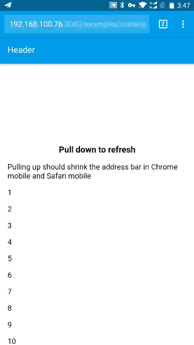
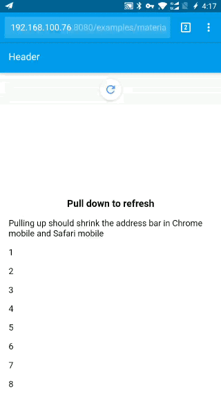

[ [English](README.md) ]

# Pull to refresh

移动端下拉刷新控件. 体积小无依赖.

## 预览

请在手机版Chrome, Safari中查看, 或打开PC版Chrome DevTools的手机模拟器.

[Material style](https://jiangfengming.github.io/pull-to-refresh/examples/material.html):  


[Material style - colorful](https://jiangfengming.github.io/pull-to-refresh/examples/material-colorful.html):  


[Material style 2](https://jiangfengming.github.io/pull-to-refresh/examples/material2.html):  


[Material style 2 - colorful](https://jiangfengming.github.io/pull-to-refresh/examples/material2-colorful.html):  


[iOS style](https://jiangfengming.github.io/pull-to-refresh/examples/ios.html):  


## 如何使用

### 安装

```
npm install mobile-pull-to-refresh --save
```

### 引入JS和CSS (webpack)

```js
import pullToRefresh from 'mobile-pull-to-refresh'

// Import the style you want

// Material
import ptrAnimatesMaterial from 'mobile-pull-to-refresh/dist/styles/material/animates'
import 'mobile-pull-to-refresh/dist/styles/material/style.css'

// Material 2
import ptrAnimatesMaterial2 from 'mobile-pull-to-refresh/dist/styles/material2/animates'
import 'mobile-pull-to-refresh/dist/styles/material2/style.css'

// iOS
import ptrAnimatesIos from 'mobile-pull-to-refresh/dist/styles/ios/animates'
import 'mobile-pull-to-refresh/dist/styles/ios/style.css'
```

### HTML代码

请查看例子中的HTMl文件:
* [Material style](examples/material.html)
* [Material style - colorful](examples/material-colorful.html)
* [Material style 2](examples/material2.html)
* [Material style 2 - colorful](examples/material2-colorful.html)
* [iOS style](examples/ios.html)

### 调用

```js
pullToRefresh({
  container: document.querySelector('.container'),
  animates: ptrAnimatesMaterial,
  // animates: ptrAnimatesMaterial2,
  // animates: ptrAnimatesIos,

  refresh() {
    return new Promise(resolve => {
      // here to fetch the data and rerender the contents.
      setTimeout(resolve, 2000)
    })
  }
})
```

## 许可

[MIT](LICENSE)

## 友情鸣谢

* Material spinner by [jczimm](https://codepen.io/jczimm/pen/vEBpoL)
* iOS spinner by [Jianqiu Xiao](https://github.com/swordray/ispinner)
* Icons by [Google](https://material.io/icons/)
* Some css code from [Muse UI](https://museui.github.io)
