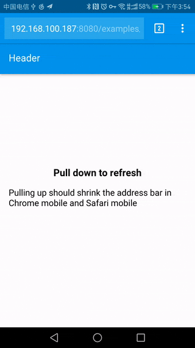
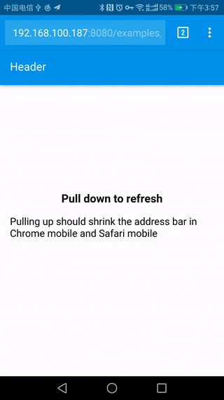
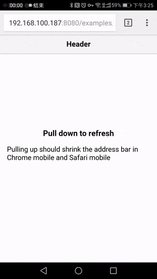

[ [中文](README-zh.md) ]

# Pull to refresh

Pull to refresh control for mobile web. Small and no dependencies.

## Previews

You can checkout the demos in Chrome mobile, Safari mobile, or toggle the device simulator on in Chrome DevTools.



[Material style](https://fenivana.github.io/pull-to-refresh/examples/material.html)



[Material style 2](https://fenivana.github.io/pull-to-refresh/examples/material2.html)



[iOS style](https://fenivana.github.io/pull-to-refresh/examples/ios.html)

## How to use

### Installing

```
npm install mobile-pull-to-refresh --save
```

### Including JS and CSS (webpack 2)

```js
import pullToRefresh from 'mobile-pull-to-refresh'

// Import the style you want

// Material
import ptrAnimatesMaterial from 'mobile-pull-to-refresh/dist/styles/material/animates'
import 'mobile-pull-to-refresh/dist/styles/material/style.css'

// Material 2
import ptrAnimatesMaterial2 from 'mobile-pull-to-refresh/dist/styles/material2/animates'
import 'mobile-pull-to-refresh/dist/styles/material2/style.css'

// iOS
import ptrAnimatesIos from 'mobile-pull-to-refresh/dist/styles/ios/animates'
import 'mobile-pull-to-refresh/dist/styles/ios/style.css'
```

### HTML snippets

Please checkout the example html files.
* [Material style](examples/material.html)
* [Material style 2](examples/material2.html)
* [iOS style](examples/ios.html)

### Invoking

```js
pullToRefresh({
  container: document.querySelector('.container'),
  animates: ptrAnimatesMaterial,
  // animates: ptrAnimatesMaterial2,
  // animates: ptrAnimatesIos,

  refresh() {
    return new Promise(resolve => {
      // here to fetch the data and rerender the contents.
      setTimeout(resolve, 2000)
    })
  }
})
```

## License

[MIT](LICENSE)

## Credit to

* Material spinner by [jczimm](https://codepen.io/jczimm/pen/vEBpoL)
* iOS spinner by [Jianqiu Xiao](https://github.com/swordray/ispinner)
* Icons by [Google](https://material.io/icons/)
* Some css code from [Muse UI](https://museui.github.io)
